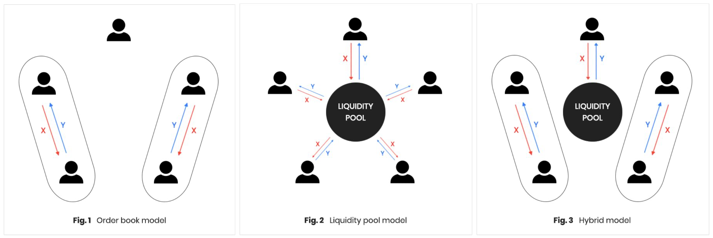

[](https://codecov.io/gh/tendermint/liquidity?branch=develop)
[](https://pkg.go.dev/github.com/tendermint/liquidity)

# Liquidity Module

The liquidity module serves AMM (Automated Market Makers) style decentralized liquidity providing and coin swap functions.

The module enables users to create a liquidity pool, make deposits and withdrawals, and request coin swaps from the liquidity pool.

This module will be used in the [Cosmos Hub](https://hub.cosmos.network/main/hub-overview/overview.html), and it can be used in any other [Cosmos SDK](https://github.com/cosmos/cosmos-sdk) based blockchain projects.

- The Cosmos Hub AMM should have strong philosophy of inclusiveness of users from different blockchains because its prime utility is inter-blockchain communication.
- To possess such characteristics, the liquidity module should provide most convenient ways for external users to come in and use the services provided by the Cosmos Hub.
- The liquidity module should not anticipate specific assets, such as Atom, into the process of user-flow in a forced manner. It is repeatedly proved that unnatural anticipation of native coin at unavoidable parts of process resulting in poor user attraction.

## Key features



**Combination of traditional orderbook-based model and new AMM model**

- Although new AMM model has multiple advantages over orderbook-based model,
combination of both models will create more enriched utilities for wider potential users.
- This module redefines the concept of a “swap order” in AMM as a “limit order with short lifetime”
in an orderbook-based exchange. Then, two concepts from two different models can be
combined as one united model so that the function can provide both ways to participate
into the trading and liquidity providing activities.
- Although our first version of the liquidity module will not provide limit order option, but
the base structure of the codebase is already anticipating such feature expansion in the
near future.
- Advantages of combined model
    - More freedom on how to provide liquidity : Limit orders
    - Combination of pool liquidity and limit order liquidity provides users more enriched trading environment

For detailed Mechanism, you can find on our recent [Paper](doc/LiquidityModuleLightPaper_EN.pdf)

## Installation

### Requirements

| Requirement | Notes            |
| ----------- | ---------------- |
| Go version  | Go1.15 or higher |
| Cosmos-SDK  | v0.42.4          |

### Get Liquidity Module source code 

```bash 
$ git clone https://github.com/tendermint/liquidity.git
$ cd liquidity
$ go mod tidy
```

### Build

```bash 
# You can find the liquidityd binary inside build directory
$ make build 
```

### Install
```bash 
$ make install 
```

## Usage of CLI Commands

### Transactions

`$ liquidityd tx liquidity --help`     

```bash
Liquidity transaction subcommands

Usage:
  liquidityd tx liquidity [flags]
  liquidityd tx liquidity [command]

Available Commands:
  create-pool Create liquidity pool and deposit coins
  deposit     Deposit coins to a liquidity pool
  swap        Swap offer coin with demand coin from the liquidity pool with the given order price
  withdraw    Withdraw pool coin from the specified liquidity pool
```

### Queries

`$ liquidityd query liquidity --help`

```bash
Querying commands for the liquidity module

Usage:
  liquidityd query liquidity [flags]
  liquidityd query liquidity [command]

Available Commands:
  batch       Query details of a liquidity pool batch
  deposit     Query the deposit messages on the liquidity pool batch
  deposits    Query all deposit messages of the liquidity pool batch
  params      Query the values set as liquidity parameters
  pool        Query details of a liquidity pool
  pools       Query for all liquidity pools
  swap        Query for the swap message on the batch of the liquidity pool specified pool-id and msg-index
  swaps       Query all swap messages in the liquidity pool batch
  withdraw    Query the withdraw messages in the liquidity pool batch
  withdraws   Query for all withdraw messages on the liquidity pool batch
```

#### A detailed document on client can be found here. [client.md](doc/client.md)

## Development

### Test
```bash 
$ make test-all
```

### 1. Setup local testnet using script

```bash
# This will bootstrap a single testnet locally.
# Note that config, data, and keys are created inside 
# ./data/localnet folder and RPC, GRPC, REST ports are all open.
$ make localnet
```

### 1.1 Broadcast transactions using CLI commands

Some sample scripts are available in [scripts](https://github.com/tendermint/liquidity/tree/develop/scripts) folder, which will help you to test out the liquidity module interface.

### 2. Setup local testnet manually

```bash
# Build 
make install

# Initialize and add keys
liquidityd init testing --chain-id testing
liquidityd keys add validator --keyring-backend test
liquidityd keys add user1 --keyring-backend test

# Add genesis accounts and provide coins to the accounts
liquidityd add-genesis-account $(liquidityd keys show validator --keyring-backend test -a) 10000000000stake,10000000000uatom,500000000000uusd
liquidityd add-genesis-account $(liquidityd keys show user1 --keyring-backend test -a) 10000000000stake,10000000000uatom,500000000000uusd

# Create gentx and collect
liquidityd gentx validator 1000000000stake --chain-id testing --keyring-backend test
liquidityd collect-gentxs

# Start
liquidityd start
```

### 2.1 Broadcast transactions using CLI commands

```bash
# An example of creating liquidity pool 1
liquidityd tx liquidity create-pool 1 1000000000uatom,50000000000uusd --from user1 --keyring-backend test --chain-id testing -y

# An example of creating liquidity pool 2 
liquidityd tx liquidity create-pool 1 10000000stake,10000000uusd --from validator --keyring-backend test --chain-id testing -y

# An example of requesting swap 
liquidityd tx liquidity swap 1 1 50000000uusd uatom 0.019 0.003 --from validator --chain-id testing --keyring-backend test -y

# An example of generating unsigned tx
validator=$(liquidityd keys show validator --keyring-backend test -a)
liquidityd tx liquidity swap 1 1 50000000uusd uatom 0.019 0.003 --from $validator --chain-id testing --generate-only > tx_swap.json
cat tx_swap.json

# Sign the unsigned tx
liquidityd tx sign tx_swap.json --from validator --chain-id testing --keyring-backend test -y > tx_swap_signed.json
cat tx_swap_signed.json

# Encode the signed tx
liquidityd tx encode tx_swap_signed.json
```
### 2.2 Broadcaste transactions using REST APIs

An example of broadcasting transactions using REST API (via gRPC-gateway) can be found in this [link](https://github.com/cosmos/cosmos-sdk/blob/master/docs/migrations/rest.md#migrating-to-new-rest-endpoints). Note that API server should be enabled in `$HOME/.liquidityapp/config/app.toml` to test this.

```bash
curl --header "Content-Type: application/json" --request POST --data '{"tx_bytes":"Cp0BCpoBCigvdGVuZGVybWludC5saXF1aWRpdHkuTXNnU3dhcFdpdGhpbkJhdGNoEm4KLWNvc21vczE4cWM2ZGwwNDZ1a3V0MjN3NnF1dndmenBmeWhncDJmeHFkcXAwNhACGAEiEAoEdXVzZBIINTAwMDAwMDAqBXVhdG9tMg0KBHV1c2QSBTc1MDAwOhExOTAwMDAwMDAwMDAwMDAwMBJYClAKRgofL2Nvc21vcy5jcnlwdG8uc2VjcDI1NmsxLlB1YktleRIjCiEDsouFptHWGniIBzFrsE26PcfH950qjnf4RaEsd+g2fA0SBAoCCH8YAxIEEMCaDBpAOI3k8fay9TziZbl+eNCqmPEF7tWXua3ad0ldNR6XOgZjKRBP9sQSxCtaRFnqc6Avep9C4Rjt+CHDahRNpZ8u3A==","mode":1}' localhost:1317/cosmos/tx/v1beta1/txs
```

### 2.3 Export Genesis State

`$ liquidityd export`

### export empty state case

```json
{
  "liquidity": {
    "params": {
      "init_pool_coin_mint_amount": "1000000",
      "pool_creation_fee": [
        {
          "amount": "100000000",
          "denom": "stake"
        }
      ],
      "max_order_amount_ratio": "0.100000000000000000",
      "min_init_deposit_amount": "1000000",
      "pool_types": [
        {
          "description": "",
          "id": 1,
          "max_reserve_coin_num": 2,
          "min_reserve_coin_num": 2,
          "name": "DefaultPoolType"
        }
      ],
      "max_reserve_coin_amount": "0",
      "swap_fee_rate": "0.003000000000000000",
      "unit_batch_height": 1,
      "withdraw_fee_rate": "0.003000000000000000"
    },
    "pool_records": []
  }
}
```

### export when some states exist

```json
{
  "liquidity": {
    "params": {
      "init_pool_coin_mint_amount": "1000000",
      "max_order_amount_ratio": "0.100000000000000000",
      "max_reserve_coin_amount": "0",
      "min_init_deposit_amount": "1000000",
      "pool_creation_fee": [
        {
          "amount": "100000000",
          "denom": "stake"
        }
      ],
      "pool_types": [
        {
          "description": "",
          "id": 1,
          "max_reserve_coin_num": 2,
          "min_reserve_coin_num": 2,
          "name": "DefaultPoolType"
        }
      ],
      "swap_fee_rate": "0.003000000000000000",
      "unit_batch_height": 1,
      "withdraw_fee_rate": "0.003000000000000000"
    },
    "pool_records": [
      {
        "deposit_msg_states": [],
        "pool": {
          "id": "1",
          "pool_coin_denom": "pool96EF6EA6E5AC828ED87E8D07E7AE2A8180570ADD212117B2DA6F0B75D17A6295",
          "reserve_account_address": "cosmos1jmhkafh94jpgakr735r70t32sxq9wzkayzs9we",
          "reserve_coin_denoms": [
            "uatom",
            "uusd"
          ],
          "type_id": 1
        },
        "pool_batch": {
          "begin_height": "563",
          "deposit_msg_index": "2",
          "executed": false,
          "index": "3",
          "pool_id": "1",
          "swap_msg_index": "2",
          "withdraw_msg_index": "2"
        },
        "pool_metadata": {
          "pool_coin_total_supply": {
            "amount": "1089899",
            "denom": "pool96EF6EA6E5AC828ED87E8D07E7AE2A8180570ADD212117B2DA6F0B75D17A6295"
          },
          "pool_id": "1",
          "reserve_coins": [
            {
              "amount": "1088843820",
              "denom": "uatom"
            },
            {
              "amount": "54551075322",
              "denom": "uusd"
            }
          ]
        },
        "swap_msg_states": [],
        "withdraw_msg_states": []
      },
      {
        "deposit_msg_states": [],
        "pool": {
          "id": "2",
          "pool_coin_denom": "poolA4648A10F8D43B8EE4D915A35CB292618215D9F60CE3E2E29216489CF1FAE049",
          "reserve_account_address": "cosmos153jg5y8c6sacaexezk34ev5jvxpptk0kscrx0x",
          "reserve_coin_denoms": [
            "stake",
            "uusd"
          ],
          "type_id": 1
        },
        "pool_batch": {
          "begin_height": "0",
          "deposit_msg_index": "1",
          "executed": false,
          "index": "1",
          "pool_id": "2",
          "swap_msg_index": "1",
          "withdraw_msg_index": "1"
        },
        "pool_metadata": {
          "pool_coin_total_supply": {
            "amount": "1000000",
            "denom": "poolA4648A10F8D43B8EE4D915A35CB292618215D9F60CE3E2E29216489CF1FAE049"
          },
          "pool_id": "2",
          "reserve_coins": [
            {
              "amount": "10000000",
              "denom": "stake"
            },
            {
              "amount": "10000000",
              "denom": "uusd"
            }
          ]
        },
        "swap_msg_states": [],
        "withdraw_msg_states": []
      }
    ]
  }
}
```

### Protobuf and Swagger

The API documentation for the liquidity module can be found on `http://localhost:1317/swagger-liquidity/` when you successfully boostrap your testnet in your local computer. Note that `swagger` config should be `true` in `$HOME/.liquidityapp/config/app.toml`. 
You can also reference our [public swagger API documentation](https://app.swaggerhub.com/apis-docs/bharvest/cosmos-sdk_liquidity_module_rest_and_g_rpc_gateway_docs). 

```bash
# Generate `*.pb.go`, `*.pb.gw.go` files from `proto/*.proto`
$ make proto-gen

# Generate `swagger.yaml` from `proto/*.proto`
$ make proto-swagger-gen
```
 
## Resources

To dive into more about the liquidity module, check out the following resources.

 - [Liquidity Module Spec](x/liquidity/spec)
 - [Liquidity Module Lite Paper (English)](doc/LiquidityModuleLightPaper_EN.pdf)
 - [Liquidity Module Lite Paper (Korean)](doc/LiquidityModuleLightPaper_KO.pdf)
 - [Liquidity Module Lite Paper (Chinese)](doc/LiquidityModuleLightPaper_ZH.pdf)
 - [Proposal and milestone](https://github.com/b-harvest/Liquidity-Module-For-the-Hub)
 - [Swagger HTTP API doc](https://app.swaggerhub.com/apis-docs/bharvest/cosmos-sdk_liquidity_module_rest_and_g_rpc_gateway_docs)
 - [godoc](https://pkg.go.dev/github.com/tendermint/liquidity)
 - [Client doc](doc/client.md)
 
